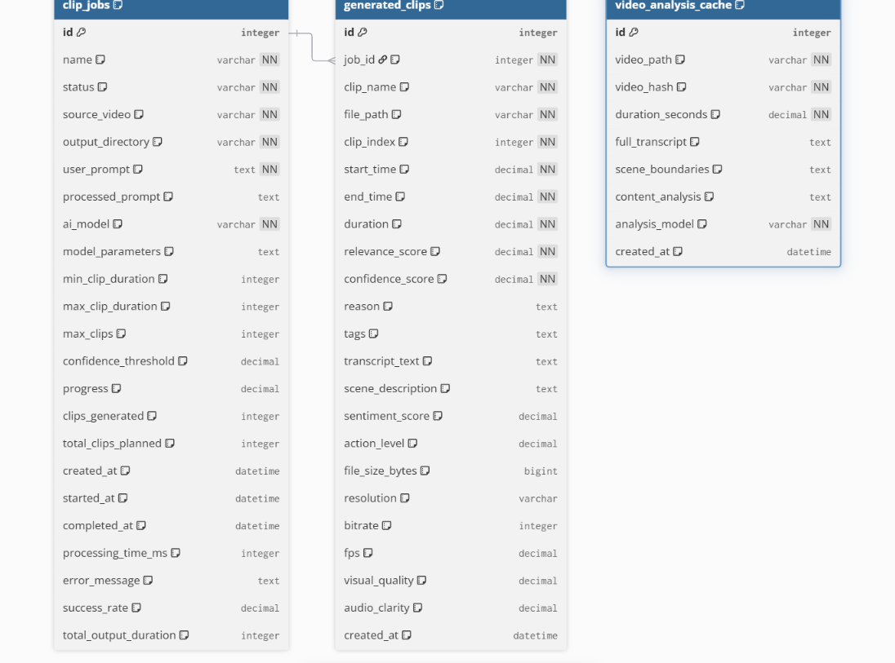

# AI Video Clip Creator

An intelligent CLI application that automatically generates multiple short-form video clips from long-form content, complete with captions and customizable clipping parameters.

## Overview

Transform your long-form videos into engaging short-form content with AI-powered analysis and automated clipping. Simply provide a video file and specify your requirements through prompts - the application handles the rest, from scene analysis to caption generation.

## Features

- **AI-Powered Video Analysis**: Intelligent content analysis to identify optimal clip segments
- **Automated Clipping**: Generate multiple short-form videos from a single long-form source
- **Smart Caption Generation**: Automatic transcription and caption overlay
- **Customizable Parameters**: Control clip duration, quantity, and selection criteria through prompts
- **Local Processing**: All processing happens locally on your machine
- **Progress Tracking**: Monitor job status and processing progress
- **Quality Control**: Confidence scoring and relevance assessment for generated clips

## Planned Features

- **Secondary Video Integration**: Add supplementary video content to clips for enhanced user retention
- **Advanced Filtering**: More sophisticated clip selection based on sentiment and action levels
- **Batch Processing**: Handle multiple source videos simultaneously

## Database Structure

The application uses a relational database to track processing jobs, generated clips, and analysis results:

The database consists of three main tables:
- **clip_jobs**: Manages processing jobs with user prompts, AI model configuration, and progress tracking
- **generated_clips**: Stores individual clip metadata including timing, quality metrics, and file information  
- **video_analysis_cache**: Caches comprehensive video analysis results including transcripts, scene boundaries, and content analysis

## Project Status

🚧 **Early Development** - This project is in active development. Core features and documentation are being built out.

## Contributing

This is currently a personal project for local use. Contribution guidelines may be added in the future.
